Análisis temporal para la acción del Grupo Éxito.
================
Jose Daniel Gallego Giraldo
2025-10-20

- [1) Descarga y transformación inicial de
  datos](#1-descarga-y-transformación-inicial-de-datos)
- [2) Gráfico de la serie diaria
  ajustada](#2-gráfico-de-la-serie-diaria-ajustada)
- [3) Data frame diario y comienzo de semana
  (lunes)](#3-data-frame-diario-y-comienzo-de-semana-lunes)
- [4) Boxplots por semana](#4-boxplots-por-semana)
- [5) Medias y medianas semanales y comparación de
  robustez](#5-medias-y-medianas-semanales-y-comparación-de-robustez)
- [6) Media y mediana superpuestas a los
  boxplots](#6-media-y-mediana-superpuestas-a-los-boxplots)
- [7) Resumen de robustez (MAE
  promedio)](#7-resumen-de-robustez-mae-promedio)
- [8) Serie semanal basada en la
  mediana](#8-serie-semanal-basada-en-la-mediana)
- [9) Rupturas semanales y último segmento (Opción
  A)](#9-rupturas-semanales-y-último-segmento-opción-a)
- [10) Descomposición y prueba de
  estacionariedad](#10-descomposición-y-prueba-de-estacionariedad)
- [11) Pruebas de homogeneidad de varianzas
  (Levene)](#11-pruebas-de-homogeneidad-de-varianzas-levene)
- [12) Transformación Box–Cox](#12-transformación-boxcox)
- [13) Transformación de potencia
  (powerTransform)](#13-transformación-de-potencia-powertransform)
- [14) Boxplots por ventanas (4 y 12
  semanas)](#14-boxplots-por-ventanas-4-y-12-semanas)
- [15) ACF y PACF de la serie
  recortada](#15-acf-y-pacf-de-la-serie-recortada)
- [16) Transformación logarítmica y
  diferenciación](#16-transformación-logarítmica-y-diferenciación)
- [17) ACF y PACF de la serie transformada y
  diferenciada](#17-acf-y-pacf-de-la-serie-transformada-y-diferenciada)
- [18) Selección del mejor modelo (no
  estacional)](#18-selección-del-mejor-modelo-no-estacional)
- [19) Verificación del mejor modelo
  seleccionado](#19-verificación-del-mejor-modelo-seleccionado)
- [20) Validación rolling-origin (h=3) y MAPE por
  horizonte](#20-validación-rolling-origin-h3-y-mape-por-horizonte)

## 1) Descarga y transformación inicial de datos

``` r
# Descarga de precios diarios de la acción del Grupo Éxito desde Yahoo Finance
sym <- "EXITO.CL"        # o "EXTOY" si quieres la serie en USD
x <- quantmod::getSymbols(sym, src = "yahoo", from = "2000-01-01", auto.assign = FALSE)

# Precio ajustado (ajustado por dividendos y splits)
adj_d <- quantmod::Ad(x)
colnames(adj_d) <- "adj_close"

# Conversión a objeto ts de frecuencia diaria (365)
adj_d_td_ts <- stats::ts(
  as.numeric(adj_d[, 1]),
  start = c(as.integer(format(zoo::index(adj_d)[1], "%Y")), 1),  # día hábil 1 del año de inicio
  frequency = 365
)
```

## 2) Gráfico de la serie diaria ajustada

``` r
plot(adj_d_td_ts, main = "SERIE DE VALORES DIARIOS DE LAS ACCIONES AJUSTADAS")
```

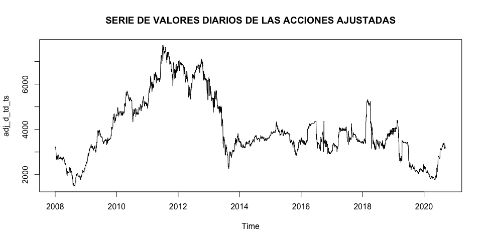<!-- -->

## 3) Data frame diario y comienzo de semana (lunes)

``` r
df <- data.frame(
  date  = as.Date(index(adj_d)),
  price = as.numeric(adj_d)
) |>
  mutate(week_start = floor_date(date, unit = "week", week_start = 1))  # lunes
```

## 4) Boxplots por semana

``` r
# Boxplots por semana (cada caja = una semana)
p1 <- ggplot(df, aes(x = week_start, y = price, group = week_start)) +
  geom_boxplot(outlier.alpha = 0.5) +
  scale_x_date(date_breaks = "3 months", date_labels = "%Y-%m") +
  labs(title = "EXITO.CL — Boxplots semanales (precio ajustado)",
       x = "Semana (inicio)", y = "Precio") +
  theme_minimal()
p1
```

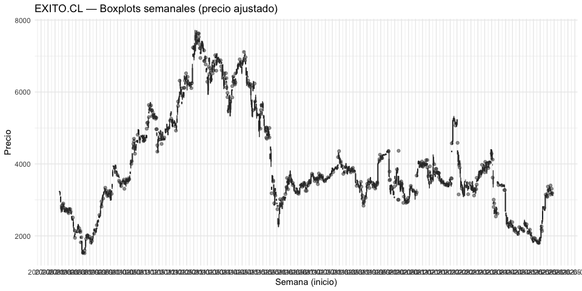<!-- -->

## 5) Medias y medianas semanales y comparación de robustez

``` r
# --- 3) Medias y medianas semanales y comparación de robustez ---
wk_stats <- df |>
  group_by(week_start) |>
  summarise(
    mean_w   = mean(price, na.rm = TRUE),
    median_w = median(price, na.rm = TRUE),
    mae_mean = mean(abs(price - mean_w), na.rm = TRUE),   # desviación media a la media
    mae_med  = mean(abs(price - median_w), na.rm = TRUE), # desviación media a la mediana
    .groups = "drop"
  )
```

## 6) Media y mediana superpuestas a los boxplots

``` r
# Visual: superponer media y mediana sobre las cajas
wk_stats_long <- wk_stats |>
  pivot_longer(c(mean_w, median_w), names_to = "stat", values_to = "value")

p2 <- p1 +
  geom_point(data = wk_stats_long,
             aes(y = value, color = stat), size = 1.6, alpha = 0.9) +
  scale_color_manual(values = c(mean_w = "black", median_w = "red"),
                     labels = c(mean_w = "Media semanal", median_w = "Mediana semanal"),
                     name = "") +
  guides(color = guide_legend(override.aes = list(size = 3)))

print(p2)
```

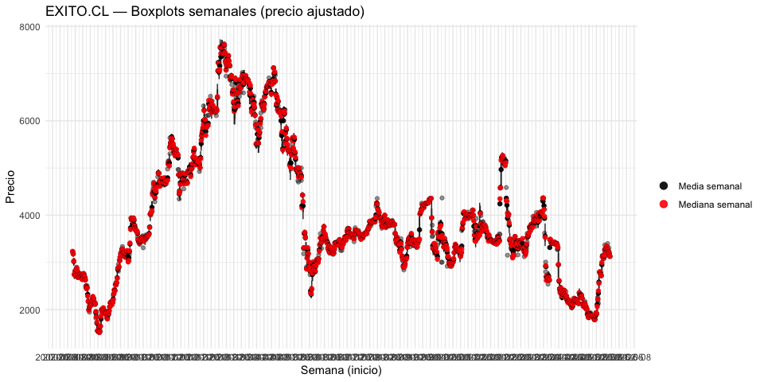<!-- -->

## 7) Resumen de robustez (MAE promedio)

``` r
# Resumen para decidir: menor MAE promedio = más robusto
c(
  MAE_promedio_media   = mean(wk_stats$mae_mean, na.rm = TRUE),
  MAE_promedio_mediana = mean(wk_stats$mae_med,  na.rm = TRUE)
)
```

    ##   MAE_promedio_media MAE_promedio_mediana 
    ##             40.21077             36.04401

## 8) Serie semanal basada en la mediana

``` r
## VAMOS A USAR LA MEDIANA SEMANAL.

df_w <- data.frame(
  date  = as.Date(index(adj_d)),
  price = as.numeric(adj_d[,1])
) %>%
  mutate(week_start = floor_date(date, unit = "week", week_start = 1)) %>%
  group_by(week_start) %>%
  summarise(median_week = median(price, na.rm = TRUE), .groups = "drop")

# 2) Serie temporal semanal en xts (índice = lunes de cada semana)
adj_w_median_xts <- xts::xts(df_w$median_week, order.by = df_w$week_start)
colnames(adj_w_median_xts) <- "median_weekly_adj_close"

start_year <- year(df_w$week_start[1])
start_week <- isoweek(df_w$week_start[1])
adj_w_median_ts <- ts(df_w$median_week,
                      start = c(start_year, start_week),
                      frequency = 52)

adj_w_median_ts <- stats::na.omit(adj_w_median_ts)
```

## 9) Rupturas semanales y último segmento (Opción A)

``` r
# --- Serie semanal (ts) ---
y_w <- adj_w_median_ts  

# 1) Breakpoints en PRECIO ~ tiempo (semanal)
bp_p_w <- breakpoints(y_w ~ time(y_w))

# 2) Retornos log semanales como ts 
ret_w <- diff(log(y_w))
bp_ret_w <- breakpoints(ret_w ~ 1)

summary(bp_p_w); summary(bp_ret_w)
```

    ## 
    ##   Optimal (m+1)-segment partition: 
    ## 
    ## Call:
    ## breakpoints.formula(formula = y_w ~ time(y_w))
    ## 
    ## Breakpoints at observation number:
    ##                            
    ## m = 1           367        
    ## m = 2       251 396        
    ## m = 3       251 396     738
    ## m = 4       251 399 557 738
    ## m = 5   139 297 436 621 760
    ## 
    ## Corresponding to breakdates:
    ##                                                     
    ## m = 1                     2014(3)                   
    ## m = 2            2011(43) 2014(32)                  
    ## m = 3            2011(43) 2014(32)          2021(10)
    ## m = 4            2011(43) 2014(35) 2017(37) 2021(10)
    ## m = 5   2009(35) 2012(37) 2015(20) 2018(49) 2021(32)
    ## 
    ## Fit:
    ##                                                                
    ## m   0         1         2         3         4         5        
    ## RSS 1.615e+09 3.991e+08 2.710e+08 1.974e+08 1.880e+08 2.305e+08
    ## BIC 1.601e+04 1.473e+04 1.439e+04 1.411e+04 1.409e+04 1.430e+04

    ## 
    ##   Optimal (m+1)-segment partition: 
    ## 
    ## Call:
    ## breakpoints.formula(formula = ret_w ~ 1)
    ## 
    ## Breakpoints at observation number:
    ##                            
    ## m = 1       255            
    ## m = 2       262 412        
    ## m = 3       262 412     743
    ## m = 4       262 412 573 743
    ## m = 5   142 281 420 573 743
    ## 
    ## Corresponding to breakdates:
    ##                                                    
    ## m = 1            2011(48)                          
    ## m = 2            2012(3)  2014(49)                 
    ## m = 3            2012(3)  2014(49)         2021(16)
    ## m = 4            2012(3)  2014(49) 2018(2) 2021(16)
    ## m = 5   2009(39) 2012(22) 2015(5)  2018(2) 2021(16)
    ## 
    ## Fit:
    ##                                                                
    ## m   0         1         2         3         4         5        
    ## RSS     1.334     1.330     1.321     1.318     1.318     1.323
    ## BIC -3426.600 -3415.717 -3407.813 -3396.458 -3383.062 -3365.923

``` r
# 3) Elegir número de rupturas (m_star) y extraer último segmento con breakdates
m_star <- 3  
bd_w <- breakdates(bp_p_w, breaks = m_star)
last_start_w <- if (m_star == 0) start(y_w) else bd_w[m_star] + deltat(y_w)

# Último tramo para graficar
adj_last_w <- window(y_w, start = last_start_w)

#### GRAFICAR LA SERIE SEMANAL MEDIANA EN EL ÚLTIMO TRAMO
ts.plot(adj_last_w,
        ylab = "VALOR MEDIANO DE CIERRE ACCION SEMANAL",
        main = "SERIE DE LOS VALORES DE CIERRE MEDIANO SEMANALES DEL GRUPO EXITO",
        lwd = 2)
grid(col = "black")
```

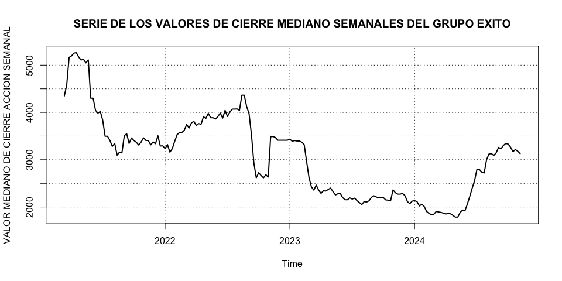<!-- -->

## 10) Descomposición y prueba de estacionariedad

``` r
#### GRAFICAMOS LA DESCOMPOSICIÓN ADITIVA DE LA SERIE
descomp <- decompose(adj_last_w)
plot(descomp)
```

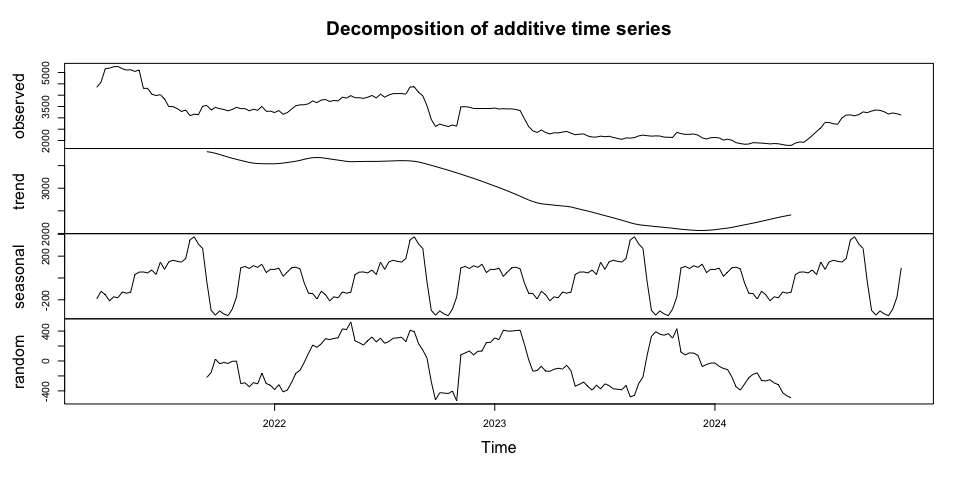<!-- -->

``` r
### HACEMOS EL TEST DE DICKEY-FULLER PARA ESTACIONARIDAD
df_ <- adf.test(adj_last_w)
df_
```

    ## 
    ##  Augmented Dickey-Fuller Test
    ## 
    ## data:  adj_last_w
    ## Dickey-Fuller = -2.894, Lag order = 5, p-value = 0.2021
    ## alternative hypothesis: stationary

## 11) Pruebas de homogeneidad de varianzas (Levene)

``` r
## OBSERVAMOS QUE NO RECHAZAMOS H0, POR LO QUE LA SERIE NO ES ESTACIONARIA,
## ALGO CLARO DE VER POR LA TENDENCIA EN EL GRÁFICO DE DESCOMPOSICIÓN 

segmentos_mensual <- cut(1:length(adj_last_w), breaks = 4)
segmentos_trimestral <- cut(1:length(adj_last_w), breaks = 12)

pl_mensual <- leveneTest(adj_last_w ~ segmentos_mensual)  ## en realidad es anual
print(pl_mensual)
```

    ## Levene's Test for Homogeneity of Variance (center = median)
    ##        Df F value   Pr(>F)   
    ## group   3  5.0619 0.002152 **
    ##       187                    
    ## ---
    ## Signif. codes:  0 '***' 0.001 '**' 0.01 '*' 0.05 '.' 0.1 ' ' 1

``` r
pl_trimestral <- leveneTest(adj_last_w ~ segmentos_trimestral)
print(pl_trimestral)
```

    ## Levene's Test for Homogeneity of Variance (center = median)
    ##        Df F value    Pr(>F)    
    ## group  11  4.9053 1.255e-06 ***
    ##       179                      
    ## ---
    ## Signif. codes:  0 '***' 0.001 '**' 0.01 '*' 0.05 '.' 0.1 ' ' 1

``` r
## VEMOS QUE TANTO MENSUAL COMO TRIMESTRAL SE RECHAZA LA HIPÓTESIS DE 
## HOMOGENEIDAD DE VARIANZAS, DE IGUAL FORMA MIRAREMOS MEDIANTE EL GRÁFICO DE BOX-COX
```

## 12) Transformación Box–Cox

``` r
boxcox(adj_last_w ~ 1,
       lambda = seq(-2, 2, 1/10),
       plotit = TRUE,
       xlab = expression(lambda),
       ylab = "Transformación Box-Cox")
```

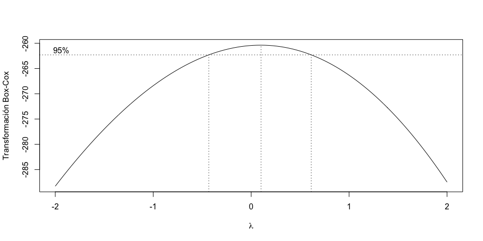<!-- -->

``` r
## OBSERVAMOS QUE EL VALOR DE BOX Y COX ESTÁ CERCA DE 0,
## POR LO QUE SE NECESITARÁ UNA TRANSFORMACIÓN LOGARÍTMICA
## PARA CONTROLAR LA VARIANZA.
```

## 13) Transformación de potencia (powerTransform)

``` r
powerTransform(adj_last_w)
```

    ## Estimated transformation parameter 
    ## adj_last_w 
    ## 0.09629592

## 14) Boxplots por ventanas (4 y 12 semanas)

``` r
##### GRAFIQUEMOS LOS BOXPLOTS

serie_ts <- adj_last_w   # CAMBIO (antes adj_last)

# CAMBIO: índice de semana (no usamos fechas mensuales)
Semana <- seq_along(serie_ts)
datos  <- data.frame(Semana = Semana, Valor = as.numeric(serie_ts))  # CAMBIO

tamano_ventana <- 4  # CAMBIO: 4 semanas

datos <- datos %>%
  mutate(
    # CAMBIO: semanas transcurridas desde el inicio (1,2,3,...)
    Semana  = as.integer(Semana),
    # CAMBIO: ventanas de 'tamano_ventana' SEMANAS
    Ventana = ceiling(Semana / tamano_ventana)
  )

ggplot(datos, aes(x = as.factor(Ventana), y = Valor)) +
  geom_boxplot(fill = "skyblue", color = "darkblue") +
  labs(
    title = paste0("Boxplot por Ventana (", tamano_ventana, " semanas) - Mediana semanal"),
    x = "Ventana (bloques de 4 semanas)",
    y = "Precio (mediana semanal)"
  ) +
  theme_minimal()
```

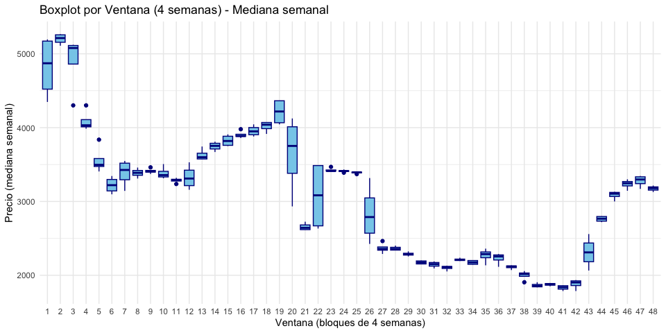<!-- -->

``` r
# === BOXPLOTS DE 12 SEMANAS ===
# CAMBIO: usar la misma serie semanal
serie_ts_mensual <- adj_last_w   # CAMBIO

# CAMBIO: índice de semana
Semana <- seq_along(serie_ts_mensual)
datos  <- data.frame(Semana = Semana, Valor = as.numeric(serie_ts_mensual))  # CAMBIO

tamano_ventana <- 12  # CAMBIO: 12 semanas

datos <- datos %>%
  mutate(
    Semana  = as.integer(Semana),          # CAMBIO
    Ventana = ceiling(Semana / tamano_ventana)  # CAMBIO
  )

ggplot(datos, aes(x = as.factor(Ventana), y = Valor)) +
  geom_boxplot(fill = "skyblue", color = "darkblue") +
  labs(
    title = paste0("Boxplot por Ventana (", tamano_ventana, " semanas) - Mediana semanal"),
    x = "Ventana (bloques de 12 semanas)",
    y = "Precio (mediana semanal)"
  ) +
  theme_minimal()
```

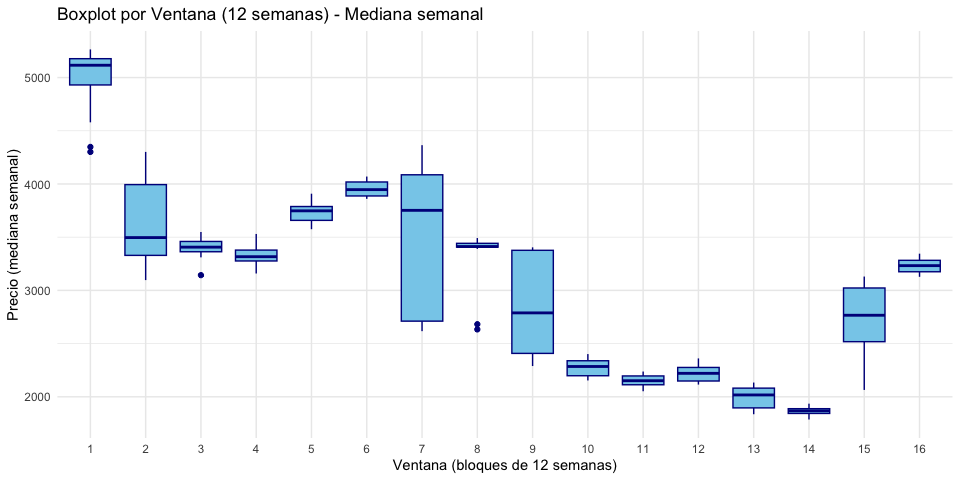<!-- -->

## 15) ACF y PACF de la serie recortada

``` r
## EFECTIVAMENTE SE OBSERVAN CAMBIOS EN LA VARIABILIDAD, REFORZANDO NUESTRO SUPUESTO
## DE LA NECESIDAD DE APLICAR LA TRANSFORMACIÓN

### AHORA MIREMOS LA ACF Y PACF DE LA SERIE RECORTADA (SEGMENTO DEFINIDO POR LOS BREAKPOINTS)
par(mfrow = c(2, 1))
acf(adj_last_w, lag.max = 52, main = "ACF de la serie")     
pacf(adj_last_w, lag.max = 52, main = "PACF de la serie")
```

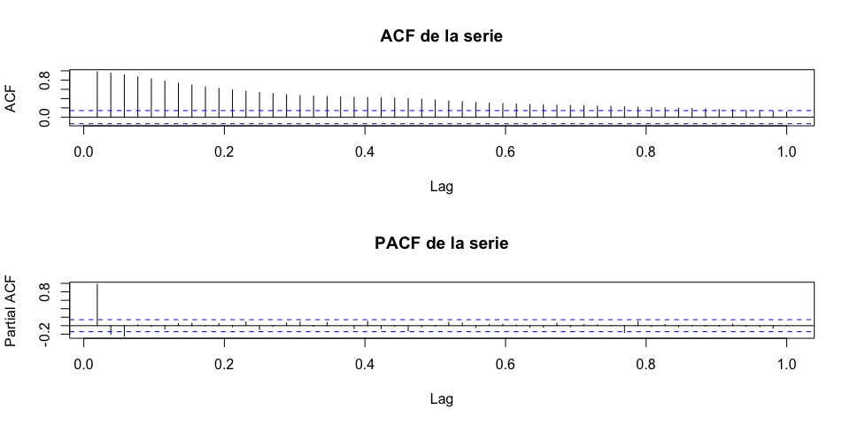<!-- -->

``` r
## OBSERVAMOS UN DECAIMIENTO LENTO, LO QUE INDICA NECESIDAD DE DIFERENCIACIÓN,
## ALGO QUE YA SUPONÍAMOS MEDIANTE LA PRUEBA DE DICKEY-FULLER
```

## 16) Transformación logarítmica y diferenciación

``` r
### AHORA APLIQUEMOS LA TRANSFORMACIÓN DE BOX-COX (LOGARÍTMICA) A LA SERIE Y LUEGO LA DIFERENCIAMOS

adj_last_w_log <- log(adj_last_w)

## COMO VIMOS ANTERIORMENTE, LA SERIE DEBE SER DIFERENCIADA 
par(mfrow = c(1, 1))
adj_last_w_logdiff <- diff(adj_last_w_log)

ts.plot(
  adj_last_w_logdiff,
  ylab = "VALOR DEL LOGARITMO DE ACCIÓN MEDIANA SEMANAL",
  main = "SERIE DEL VALOR DEL LOGARITMO DEL VALOR MEDIANO SEMANAL DIFERENCIADA",
  lwd = 2
)
grid(col = "black")
```

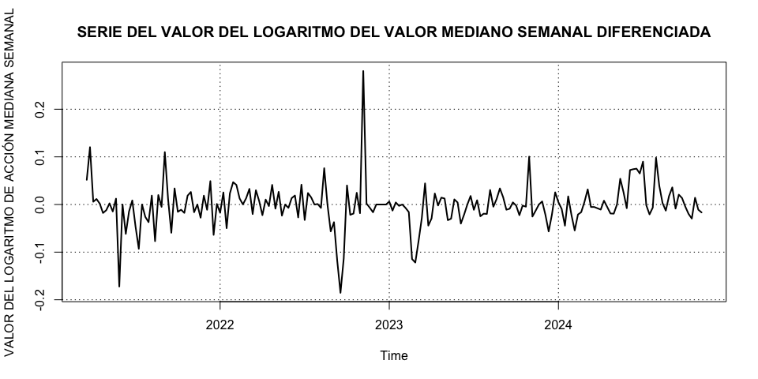<!-- -->

``` r
##OBSERVAMOS LA SERIE LUEGO DE APLICAR LA DIFERENCIACION DE BOX Y COX Y DE APLICAR LA DIFERENCIA
##PARA ESTACIONAR LA SERIE
```

## 17) ACF y PACF de la serie transformada y diferenciada

``` r
## AHORA MIREMOS LA ACF Y PACF DE LA SERIE DIFERENCIADA

par(mfrow = c(2, 1))
acf(adj_last_w_logdiff, lag.max = 12, main = "ACF de la serie transformada y diferenciada")
pacf(adj_last_w_logdiff, lag.max = 12, main = "PACF de la serie transformada y diferenciada")
```

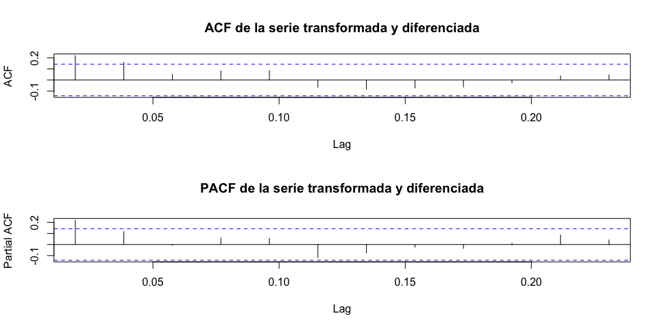<!-- -->

``` r
## OBSERVAMOS QUE, DE FORMA GENERAL, LOS RESIDUOS ESTÁN DENTRO DE LA BANDA DE CONFIANZA
```

## 18) Selección del mejor modelo (no estacional)

``` r
### AHORA VAMOS A ENCONTRAR EL MEJOR MODELO AJUSTADO

y <- adj_last_w
stopifnot(is.ts(y))               

# Órdenes máximos a explorar (no estacional)
p_max <- 2
q_max <- 2
d     <- 1                        

# Sin estacionalidad
freq_y <- frequency(y)            
seasonal_off <- list(order = c(0,0,0), period = freq_y)

# Probar con/sin drift (solo si d == 1)
drifts <- if (d == 1) c(FALSE, TRUE) else FALSE

## ================== GRID & TABLA RESULTADOS ==================
maxfilas <- (p_max + 1) * (q_max + 1) * length(drifts)
ic_mod <- matrix(NA_real_, nrow = maxfilas, ncol = 6)
colnames(ic_mod) <- c("p","q","drift","AIC","AICc","BIC")

k <- 1
for (i in 0:p_max) {
  for (j in 0:q_max) {
    for (dr in drifts) {
      
      fit <- tryCatch(
        Arima(y,
              order = c(i, d, j),
              seasonal = seasonal_off,     # SIN estacionalidad
              method = "ML",
              include.mean  = (d == 0),
              include.drift = dr),
        error = function(e) NULL,
        lambda = 0
      )
      
      ic_mod[k, 1:3] <- c(i, j, as.integer(dr))
      
      if (!is.null(fit)) {
        n   <- length(residuals(fit))
        kf  <- as.numeric(attr(logLik(fit), "df"))   # nº de parámetros
        aic <- AIC(fit)
        bic <- BIC(fit)
        
        # AICc manual (si n - kf - 1 <= 0, deja NA para no seleccionar ese modelo)
        aicc <- if ((n - kf - 1) > 0) {
          aic + (2 * kf * (kf + 1)) / (n - kf - 1)
        } else {
          NA_real_
        }
        
        ic_mod[k, 4:6] <- c(aic, aicc, bic)
      }
      k <- k + 1
    }
  }
}

ic_df <- as.data.frame(ic_mod)

## ================== ORDENAR Y ELEGIR MEJOR ==================
# Ordenar por AICc (mejor arriba). Si todos AICc son NA, usa BIC.
if (all(is.na(ic_df$AICc))) {
  message("Todos los AICc son NA; se ordena por BIC.")
  ic_df_ord <- ic_df[order(ic_df$BIC, na.last = NA), , drop = FALSE]
} else {
  ic_df_ord <- ic_df[order(ic_df$AICc, na.last = NA), , drop = FALSE]
}

cat("\n=== TOP modelos (mejor arriba) ===\n")
```

    ## 
    ## === TOP modelos (mejor arriba) ===

``` r
print(head(ic_df_ord, 10))
```

    ##    p q drift      AIC     AICc      BIC
    ## 13 2 0     0 2439.333 2439.461 2449.074
    ## 5  0 2     0 2439.650 2439.779 2449.392
    ## 9  1 1     0 2440.821 2440.950 2450.562
    ## 14 2 0     1 2441.226 2441.441 2454.214
    ## 15 2 1     0 2441.302 2441.517 2454.290
    ## 6  0 2     1 2441.493 2441.708 2454.481
    ## 11 1 2     0 2441.643 2441.858 2454.631
    ## 7  1 0     0 2442.425 2442.488 2448.919
    ## 10 1 1     1 2442.723 2442.938 2455.711
    ## 16 2 1     1 2443.188 2443.512 2459.423

``` r
best <- ic_df_ord[1, , drop = FALSE]

best_fit <- Arima(
  y,
  order = c(best$p, d, best$q),
  seasonal = seasonal_off,
  method = "ML",
  include.mean  = (d == 0),
  include.drift = as.logical(best$drift),
  lambda = 0
)
```

## 19) Verificación del mejor modelo seleccionado

``` r
### OBSERVAMOS QUE EL MODELO ARIMA(2,1,0) CUMPLE EL SUPUESTO 

cat("\n=== Mejor modelo no estacional seleccionado ===\n")
```

    ## 
    ## === Mejor modelo no estacional seleccionado ===

``` r
print(best_fit)
```

    ## Series: y 
    ## ARIMA(2,1,0) 
    ## Box Cox transformation: lambda= 0 
    ## 
    ## Coefficients:
    ##          ar1     ar2
    ##       0.1964  0.1247
    ## s.e.  0.0718  0.0730
    ## 
    ## sigma^2 = 0.00196:  log likelihood = 323.67
    ## AIC=-641.34   AICc=-641.21   BIC=-631.6

``` r
checkresiduals(best_fit)
```

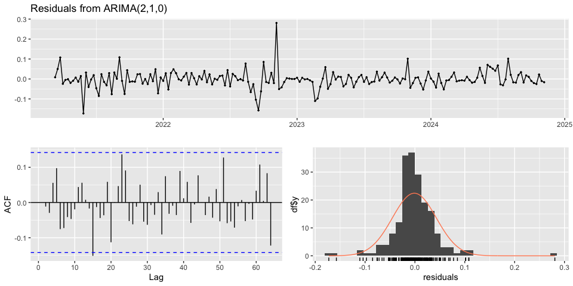<!-- -->

    ## 
    ##  Ljung-Box test
    ## 
    ## data:  Residuals from ARIMA(2,1,0)
    ## Q* = 30.23, df = 36, p-value = 0.739
    ## 
    ## Model df: 2.   Total lags used: 38

``` r
Box.test(best_fit$residuals,type = "Ljung-Box")
```

    ## 
    ##  Box-Ljung test
    ## 
    ## data:  best_fit$residuals
    ## X-squared = 9.4513e-07, df = 1, p-value = 0.9992

## 20) Validación rolling-origin (h=3) y MAPE por horizonte

``` r
par(mfrow = c(1,1))

# 1) Pronóstico directo h=3 con el mejor modelo
h  <- 3
fc <- forecast(best_fit, h = h, biasadj = TRUE)
plot(fc, main = "Pronóstico h=3 (modelo final)")
```

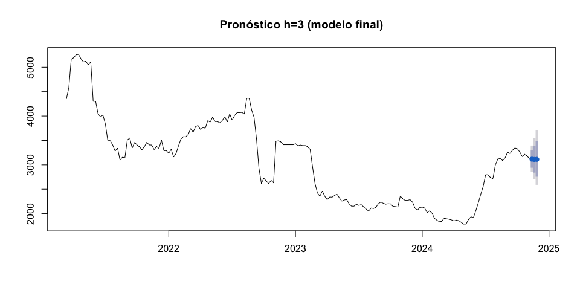<!-- -->

``` r
print(fc$mean)
```

    ## Time Series:
    ## Start = c(2024, 46) 
    ## End = c(2024, 48) 
    ## Frequency = 52 
    ## [1] 3116.094 3111.161 3113.160

``` r
# 2) Hold-out (últimas H observaciones) y MAPE
H       <- 3
y_train <- head(y, length(y) - H)
y_test  <- tail(y, H)

ord       <- arimaorder(best_fit)
use_drift <- any(names(coef(best_fit)) == "drift")

fit_ho <- Arima(y_train,
                order         = c(ord["p"], ord["d"], ord["q"]),
                seasonal      = list(order = c(0,0,0), period = frequency(y)),
                include.mean  = (ord["d"] == 0),
                include.drift = use_drift,
                lambda        = 0, method = "ML")

fc_ho <- forecast(fit_ho, h = H, biasadj = TRUE)
print(fc_ho$mean)
```

    ## Time Series:
    ## Start = c(2024, 43) 
    ## End = c(2024, 45) 
    ## Frequency = 52 
    ## [1] 3146.889 3134.576 3133.760

``` r
# --- Gráfico comparando pronóstico vs valores reales (últimas 3) ---
plot(fc_ho, main = "Pronóstico (h=3) vs. valores reales (últimas 3)")

t_test_num <- as.numeric(time(y_test))   # vector numérico
y_test_num <- as.numeric(y_test)         # vector numérico

points(t_test_num, y_test_num, pch = 19, col = "red")
lines(t_test_num, y_test_num, col = "red", lwd = 2)

# Etiquetas sobre los puntos
pos_lab <- c(3, 1, 3)
off_lab <- 0.6
dx      <- c(0, 0.12, 0.24) / frequency(y)
y_lab   <- y_test_num * c(1.012, 0.988, 1.012)

text(t_test_num + dx, y_lab,
     labels = round(y_test_num, 2),
     pos = pos_lab, offset = off_lab, cex = 0.9, col = "red")

legend("topleft",
       legend = c("Pronóstico", "Real (últimas 3)"),
       col    = c("blue", "red"),
       lty    = c(1, 1),
       pch    = c(NA, 19),
       bty    = "n")
```

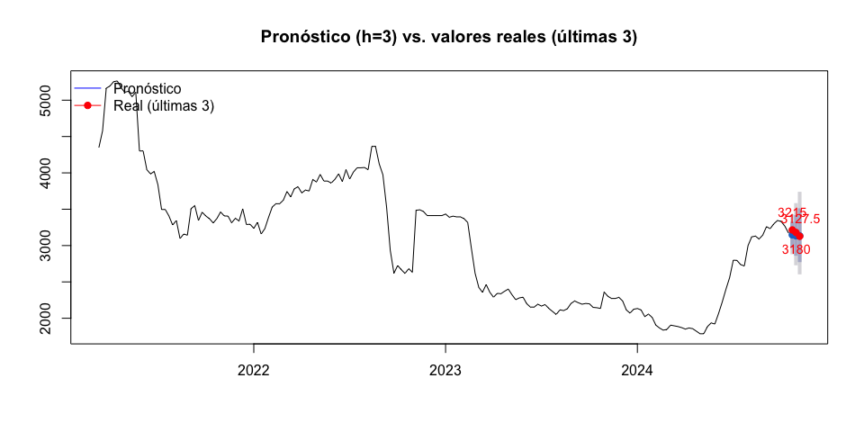<!-- -->

``` r
# MAPE del hold-out
acc <- accuracy(fc_ho, y_test)
mape_holdout <- acc["Test set", "MAPE"]
mape_holdout
```

    ## [1] 1.249037

``` r
# 3) Rolling-origin y MAPE por horizonte
n        <- length(y)
n_train  <- floor(0.8 * n)
ord_ro   <- c(ord["p"], ord["d"], ord["q"])
drift_ro <- use_drift

E <- matrix(NA_real_, nrow = n - n_train - H + 1, ncol = H)

row <- 1
for (t in n_train:(n - H)) {
  y_tr <- window(y, end   = time(y)[t])
  y_te <- window(y, start = time(y)[t + 1], end = time(y)[t + H])

  fit <- Arima(y_tr,
               order         = ord_ro,
               seasonal      = list(order = c(0,0,0), period = frequency(y)),
               include.mean  = (ord_ro[2] == 0),
               include.drift = drift_ro,
               lambda        = 0, method = "ML")

  fc <- forecast(fit, h = H, biasadj = TRUE)
  E[row, 1:H] <- as.numeric(y_te) - as.numeric(fc$mean)
  row <- row + 1
}

den1 <- window(y, start = time(y)[n_train + 1], end = time(y)[n - H + 1])
den2 <- window(y, start = time(y)[n_train + 2], end = time(y)[n - H + 2])
den3 <- window(y, start = time(y)[n_train + 3], end = time(y)[n - H + 3])

MAPE_h1 <- mean(abs(E[,1] / den1), na.rm = TRUE) * 100
MAPE_h2 <- mean(abs(E[,2] / den2), na.rm = TRUE) * 100
MAPE_h3 <- mean(abs(E[,3] / den3), na.rm = TRUE) * 100

c(MAPE_h1 = MAPE_h1, MAPE_h2 = MAPE_h2, MAPE_h3 = MAPE_h3)
```

    ##  MAPE_h1  MAPE_h2  MAPE_h3 
    ## 2.510606 4.186055 5.555176

``` r
##OBSERVAMOS UN COMPORTAMIENTO ESPERADO EN LOS MODELO ARIMA PUES LA INCERTIDUMBRE CRECE CON EL 
##HORIZONTE
```
