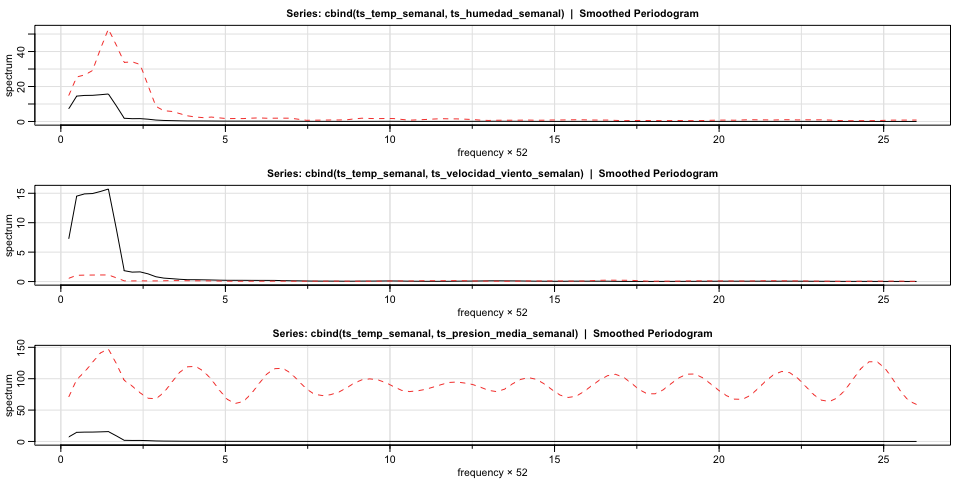

Análisis temporal para la temperatura promedio semanal en Nueva Delhi
================
Jose Daniel Gallego Giraldo
2025-10-20

- [1) Carga y preparación de datos
  diarios](#1-carga-y-preparación-de-datos-diarios)
- [2) Promedio semanal (train) y `ts`; preparación de fechas
  (test)](#2-promedio-semanal-train-y-ts-preparación-de-fechas-test)
- [3) Promedio semanal (test) y objeto
  `ts`](#3-promedio-semanal-test-y-objeto-ts)
- [4) Visualización de la serie temporal semanal
  (train)](#4-visualización-de-la-serie-temporal-semanal-train)
- [5) Descomposición aditiva de la serie temporal
  semanal](#5-descomposición-aditiva-de-la-serie-temporal-semanal)
- [6) Prueba de estacionariedad (Dickey–Fuller
  aumentada)](#6-prueba-de-estacionariedad-dickeyfuller-aumentada)
- [7) Prueba de homogeneidad de varianzas
  (Levene)](#7-prueba-de-homogeneidad-de-varianzas-levene)
- [8) Boxplots mensuales (temperaturas
  promedio)](#8-boxplots-mensuales-temperaturas-promedio)
- [9) ACF, PACF y diferenciación de la
  serie](#9-acf-pacf-y-diferenciación-de-la-serie)
- [10) ACF y PACF de la serie diferenciada y diferenciación
  estacional](#10-acf-y-pacf-de-la-serie-diferenciada-y-diferenciación-estacional)
- [11) Búsqueda y ajuste del mejor modelo
  SARIMA](#11-búsqueda-y-ajuste-del-mejor-modelo-sarima)
- [12) Gráfico de valores ajustados
  vs. observados](#12-gráfico-de-valores-ajustados-vs-observados)
- [13) Evaluación del modelo: cálculo del
  MAPE](#13-evaluación-del-modelo-cálculo-del-mape)
- [14) Incorporación de variables exógenas (promedios
  semanales)](#14-incorporación-de-variables-exógenas-promedios-semanales)
- [15) Series temporales semanales de variables exógenas y
  gráficos](#15-series-temporales-semanales-de-variables-exógenas-y-gráficos)
- [16) Coherencia espectral entre temperatura y
  exógenas](#16-coherencia-espectral-entre-temperatura-y-exógenas)
- [17) Ajuste del modelo SARIMA con variables
  exógenas](#17-ajuste-del-modelo-sarima-con-variables-exógenas)
- [18) Predicción y visualización del modelo con variables
  exógenas](#18-predicción-y-visualización-del-modelo-con-variables-exógenas)
- [19) Evaluación del modelo con exógenas: significancia y
  MAPE](#19-evaluación-del-modelo-con-exógenas-significancia-y-mape)
- [20) Evaluación del ajuste del modelo ARIMAX mediante
  residuos](#20-evaluación-del-ajuste-del-modelo-arimax-mediante-residuos)

## 1) Carga y preparación de datos diarios

``` r
DailyDelhiClimateTrain <- read.csv("DailyDelhiClimateTrain.csv")
DailyDelhiClimateTest  <- read.csv("DailyDelhiClimateTest.csv")
Entreno <- (DailyDelhiClimateTrain)
Testeo  <- (DailyDelhiClimateTest)

### TRANSFORMEMOS LA SERIE DE MEDIAS DIARIAS A MEDIAS SEMANALES

df_temp_diaria <- DailyDelhiClimateTrain %>%
  mutate(date = seq(as.Date("2013-01-01"), by = "day",
                    length.out = nrow(DailyDelhiClimateTrain)))
```

## 2) Promedio semanal (train) y `ts`; preparación de fechas (test)

``` r
# Calcular promedio semanal de la temperatura media para el train
df_temp_semanal <- df_temp_diaria %>%
  mutate(semana = floor_date(date, unit = "week")) %>%
  group_by(semana) %>%
  summarise(mean_temp = mean(meantemp, na.rm = TRUE))

ts_temp_semanal <- ts(df_temp_semanal$mean_temp, 
                      start = c(2013, 1), 
                      frequency = 52)

# Preparar data.frame diario para el set de test (con columna 'date')
df_temp_diaria_test <- DailyDelhiClimateTest %>%
  mutate(date = seq(as.Date("2017-01-01"), by = "day",
                    length.out = nrow(DailyDelhiClimateTest)))
```

## 3) Promedio semanal (test) y objeto `ts`

``` r
# Calcular promedio semanal de la temperatura media para el test
df_temp_semanal_test <- df_temp_diaria_test %>%
  mutate(semana = floor_date(date, unit = "week")) %>%
  group_by(semana) %>%
  summarise(mean_temp = mean(meantemp, na.rm = TRUE))

# Crear objeto ts semanal
ts_temp_semanal_test <- ts(df_temp_semanal_test$mean_temp, 
                           start = c(2017, 1), 
                           frequency = 52)
```

## 4) Visualización de la serie temporal semanal (train)

``` r
options(repr.plot.width = 14, repr.plot.height = 8)

ts.plot(ts_temp_semanal,
        ylab = "Temperatura promedio",
        main = "Serie del promedio de temperatura semanal",
        lwd = 2)

grid(col = "black")
```

<!-- -->

``` r
##GRAFICAMENTE OBSERVAMOS QUE SE PRESENTA UNA ESTACIONALIDAD CADA ANO APROXIMADAMENTE Y UNA VARIANZA APROXIMADAMENTE 
##CONSTANTE POR LO QUE NO APLICAREMOS UNA TRANSFOMRACION DE BOX COX
```

## 5) Descomposición aditiva de la serie temporal semanal

``` r
##OBSERVEMOS UNA DESCOMPOSICION ADITIVA CON EL FIN DE TENER INDICIOS SOBRE LA ESTACIONALIDAD Y
##LA POSIBLE TENDENCIA DE LA SERIE
descomp <- decompose(ts_temp_semanal)
plot(descomp)
```

<!-- -->

``` r
##OBSERVAMOS UNA CLARA ESTACIONALIDAD ADEMAS DE OBSERVAR UNA TENDENCIA A LA ALZA POR PARTE DE LA SERIE, 
##POR LO QUE PODRIAMOS ESPERAR QUE LA TEMPERATURA MEDIA SEMANAL ESTE AUMENTANDO, ESTO PUEDE
##DEVERSE A DIFERENTES FACTORES, COMO POSIBLES DE ELLOS EL CALENTAMIENTO GLOBAL
```

## 6) Prueba de estacionariedad (Dickey–Fuller aumentada)

``` r
## REALICEMOS UN TEST DE ESTACIONARIEDAD

df <- adf.test(ts_temp_semanal)
df
```

    ## 
    ##  Augmented Dickey-Fuller Test
    ## 
    ## data:  ts_temp_semanal
    ## Dickey-Fuller = -3.4624, Lag order = 5, p-value = 0.04746
    ## alternative hypothesis: stationary

``` r
## LA PRUEBA NOS DA COMO RESULTADO QUE LA SERIE ES ESTACIONARIA  
adf_ur <- ur.df(ts_temp_semanal, type = "trend", lags = 5)

# Ver resultado
summary(adf_ur)
```

    ## 
    ## ############################################### 
    ## # Augmented Dickey-Fuller Test Unit Root Test # 
    ## ############################################### 
    ## 
    ## Test regression trend 
    ## 
    ## 
    ## Call:
    ## lm(formula = z.diff ~ z.lag.1 + 1 + tt + z.diff.lag)
    ## 
    ## Residuals:
    ##     Min      1Q  Median      3Q     Max 
    ## -5.1821 -1.2057  0.0513  1.1587  4.9873 
    ## 
    ## Coefficients:
    ##               Estimate Std. Error t value Pr(>|t|)    
    ## (Intercept)  1.8111456  0.5494934   3.296 0.001164 ** 
    ## z.lag.1     -0.0686225  0.0198191  -3.462 0.000657 ***
    ## tt          -0.0009445  0.0022484  -0.420 0.674888    
    ## z.diff.lag1 -0.0384262  0.0685760  -0.560 0.575884    
    ## z.diff.lag2  0.0787569  0.0678908   1.160 0.247438    
    ## z.diff.lag3  0.1562982  0.0675298   2.315 0.021676 *  
    ## z.diff.lag4  0.2036512  0.0681801   2.987 0.003177 ** 
    ## z.diff.lag5  0.2890939  0.0686999   4.208 3.92e-05 ***
    ## ---
    ## Signif. codes:  0 '***' 0.001 '**' 0.01 '*' 0.05 '.' 0.1 ' ' 1
    ## 
    ## Residual standard error: 1.843 on 196 degrees of freedom
    ## Multiple R-squared:  0.1713, Adjusted R-squared:  0.1417 
    ## F-statistic: 5.787 on 7 and 196 DF,  p-value: 4.142e-06
    ## 
    ## 
    ## Value of test-statistic is: -3.4624 4.3297 6.3985 
    ## 
    ## Critical values for test statistics: 
    ##       1pct  5pct 10pct
    ## tau3 -3.99 -3.43 -3.13
    ## phi2  6.22  4.75  4.07
    ## phi3  8.43  6.49  5.47

``` r
## OBSERVAMOS QUE LA SERIE CUMPLE EL SUPUESTO DE ESTACIONARIEDAD MEDIANTE LA PRUEBA DE DICKEY–FULLER
```

## 7) Prueba de homogeneidad de varianzas (Levene)

``` r
## AHORA MIREMOS LA PRUEBA DE HOMOGENEIDAD DE VARIANZAS DE LEVENE

segmentos <- cut(1:length(ts_temp_semanal), breaks = 52)

# Prueba de Levene
pl <- leveneTest(ts_temp_semanal ~ segmentos)
print(pl)
```

    ## Levene's Test for Homogeneity of Variance (center = median)
    ##        Df F value Pr(>F)
    ## group  51  1.2618 0.1408
    ##       158

``` r
## OBSERVAMOS QUE NO RECHAZAMOS H0, POR LO QUE HAY HOMOGENEIDAD DE VARIANZAS DE FORMA ANUAL,
## LO QUE SE EVIDENCIA EN EL GRÁFICO PUES HAY UN GRAN PARECIDO EN LA SERIE A LO LARGO DE LOS AÑOS
```

## 8) Boxplots mensuales (temperaturas promedio)

``` r
## BOXPLOTS MENSUALES

fechas <- seq(as.Date("2013-01-01"), by = "week", length.out = length(ts_temp_semanal))
datos <- data.frame(Fecha = fechas, Valor = ts_temp_semanal)

tamaño_ventana <- 4  ## TOMAR UNA VENTANA MÁS ALTA, POR EJEMPLO 30 → TRIMESTRAL O SEMESTRAL

datos <- datos %>%
  mutate(
    Semana  = as.numeric(difftime(Fecha, min(Fecha), units = "weeks")),
    Ventana = ceiling(Semana / tamaño_ventana)
  )

ggplot(datos, aes(x = as.factor(Ventana), y = Valor)) +
  geom_boxplot(fill = "skyblue", color = "darkblue") +
  labs(
    title = "Boxplot por Ventana de Temperaturas Promedio Mensual",
    x = "Ventana",
    y = "Temperatura promedio (°C)"
  ) +
  theme_minimal()
```

<!-- -->

## 9) ACF, PACF y diferenciación de la serie

``` r
## ACF y PACF de la serie original
par(mfrow = c(2, 1))
acf(ts_temp_semanal, lag.max = 156, main = "ACF de la serie")
pacf(ts_temp_semanal, lag.max = 156, main = "PACF de la serie")
```

<!-- -->

``` r
## TENEMOS SOSPECHAS DE QUE LA SERIE EN REALIDAD NO ES ESTACIONARIA,
## PUES LA ACF PRESENTA UN DECAIMIENTO LENTO.
## APLIQUEMOS UNA PRIMERA DIFERENCIA A LA SERIE.

par(mfrow = c(1, 1))
ts_temp_semanal_dif <- diff(ts_temp_semanal)

ts.plot(ts_temp_semanal_dif,
        ylab = "Temperatura promedio",
        main = "Serie del promedio de temperatura semanal diferenciada",
        lwd = 2)
grid(col = "black")
```

<!-- -->

``` r
## AHORA CON LA PRIMERA DIFERENCIA OBSERVAMOS UN PATRÓN ESTACIONARIO
```

## 10) ACF y PACF de la serie diferenciada y diferenciación estacional

``` r
## ACF y PACF de la serie diferenciada (para confirmar estacionariedad)
par(mfrow = c(2, 1))
acf(ts_temp_semanal_dif, lag.max = 156, main = "ACF de la serie diferenciada")
pacf(ts_temp_semanal_dif, lag.max = 156, main = "PACF de la serie diferenciada")
```

<!-- -->

``` r
### APLIQUEMOS LA DIFERENCIACIÓN ESTACIONAL
par(mfrow = c(2, 1))

# ACF aplicando diferencia estacional cada 52 semanas
acf(diff(ts_temp_semanal_dif, lag = 52),
    lag.max = 156,
    main = "ACF aplicando diferencia estacional cada 52 semanas")

# PACF aplicando diferencia estacional cada 52 semanas
pacf(diff(ts_temp_semanal_dif, lag = 52),
     lag.max = 156,
     main = "PACF aplicando diferencia estacional cada 52 semanas")
```

<!-- -->

``` r
## OBSERVAMOS UN PICO FUERTE EN EL LAG = 1 (52 SEMANAS)
## Y UN POSIBLE DECAIMIENTO EXPONENCIAL EN LA PACF,
## POR LO QUE EL MODELO ELEGIDO PODRÍA SER UNO CON UNA MEDIA MÓVIL ESTACIONAL CADA 52 SEMANAS
```

## 11) Búsqueda y ajuste del mejor modelo SARIMA

``` r
library(astsa)

# Definir los órdenes base
p <- 1; q <- 1
P <- 1; Q <- 1
d <- 1; D <- 1
S <- 52  # Periodo estacional anual

# Cantidad total de combinaciones
maxfilas <- (p + 1) * (q + 1) * (P + 1) * (Q + 1)

# Matriz para guardar resultados
ic_mod <- matrix(NA, nrow = maxfilas, ncol = 6)
colnames(ic_mod) <- c("p", "q", "P", "Q", "AIC", "BIC")

# Iterar modelos
k <- 1
for (i in 0:p) {
  for (j in 0:q) {
    for (s in 0:P) {
      for (m in 0:Q) {
        cat("Evaluando modelo (", i, d, j, ") x (", s, D, m, ")[", S, "]\n")
        
        ajuste <- tryCatch({
          mod <- sarima(ts_temp_semanal,
                        p = i, d = d, q = j,
                        P = s, D = D, Q = m, S = S,
                        details = FALSE, no.constant = TRUE)
          ic_mod[k, ] <- c(i, j, s, m, mod$AIC, mod$BIC)
        },
        error = function(e) {
          cat("Error con modelo (", i, d, j, ") x (", s, D, m, "): ", e$message, "\n")
          ic_mod[k, ] <- c(i, j, s, m, NA, NA)
        })
        k <- k + 1
      }
    }
  }
}
```

    ## Evaluando modelo ( 0 1 0 ) x ( 0 1 0 )[ 52 ]
    ## <><><><><><><><><><><><><><>
    ##  
    ## sigma^2 estimated as 6.511676 on 157 degrees of freedom 
    ##  
    ## AIC = 4.724213  AICc = 4.724213  BIC = 4.743679 
    ##  
    ## Error con modelo ( 0 1 0 ) x ( 0 1 0 ):  number of items to replace is not a multiple of replacement length 
    ## Evaluando modelo ( 0 1 0 ) x ( 0 1 1 )[ 52 ]
    ## <><><><><><><><><><><><><><>
    ##  
    ## Coefficients: 
    ##      Estimate    SE t.value p.value
    ## sma1  -0.9999 0.456 -2.1928  0.0298
    ## 
    ## sigma^2 estimated as 3.102818 on 156 degrees of freedom 
    ##  
    ## AIC = 4.456096  AICc = 4.45626  BIC = 4.495029 
    ##  
    ## Error con modelo ( 0 1 0 ) x ( 0 1 1 ):  number of items to replace is not a multiple of replacement length 
    ## Evaluando modelo ( 0 1 0 ) x ( 1 1 0 )[ 52 ]
    ## <><><><><><><><><><><><><><>
    ##  
    ## Coefficients: 
    ##      Estimate     SE t.value p.value
    ## sar1  -0.4958 0.0747 -6.6404       0
    ## 
    ## sigma^2 estimated as 4.85213 on 156 degrees of freedom 
    ##  
    ## AIC = 4.536192  AICc = 4.536356  BIC = 4.575125 
    ##  
    ## Error con modelo ( 0 1 0 ) x ( 1 1 0 ):  number of items to replace is not a multiple of replacement length 
    ## Evaluando modelo ( 0 1 0 ) x ( 1 1 1 )[ 52 ]
    ## <><><><><><><><><><><><><><>
    ##  
    ## Coefficients: 
    ##      Estimate     SE t.value p.value
    ## sar1  -0.0239 0.1130 -0.2112  0.8330
    ## sma1  -0.9981 0.6216 -1.6055  0.1104
    ## 
    ## sigma^2 estimated as 3.070649 on 155 degrees of freedom 
    ##  
    ## AIC = 4.468555  AICc = 4.469051  BIC = 4.526954 
    ##  
    ## Error con modelo ( 0 1 0 ) x ( 1 1 1 ):  number of items to replace is not a multiple of replacement length 
    ## Evaluando modelo ( 0 1 1 ) x ( 0 1 0 )[ 52 ]
    ## <><><><><><><><><><><><><><>
    ##  
    ## Coefficients: 
    ##     Estimate     SE t.value p.value
    ## ma1  -0.8274 0.0876   -9.44       0
    ## 
    ## sigma^2 estimated as 5.327793 on 156 degrees of freedom 
    ##  
    ## AIC = 4.54364  AICc = 4.543804  BIC = 4.582573 
    ##  
    ## Error con modelo ( 0 1 1 ) x ( 0 1 0 ):  number of items to replace is not a multiple of replacement length 
    ## Evaluando modelo ( 0 1 1 ) x ( 0 1 1 )[ 52 ]
    ## <><><><><><><><><><><><><><>
    ##  
    ## Coefficients: 
    ##      Estimate     SE  t.value p.value
    ## ma1   -0.7998 0.0719 -11.1212  0.0000
    ## sma1  -0.9998 0.3079  -3.2469  0.0014
    ## 
    ## sigma^2 estimated as 2.514773 on 155 degrees of freedom 
    ##  
    ## AIC = 4.264946  AICc = 4.265442  BIC = 4.323345 
    ##  
    ## Error con modelo ( 0 1 1 ) x ( 0 1 1 ):  number of items to replace is not a multiple of replacement length 
    ## Evaluando modelo ( 0 1 1 ) x ( 1 1 0 )[ 52 ]
    ## <><><><><><><><><><><><><><>
    ##  
    ## Coefficients: 
    ##      Estimate     SE  t.value p.value
    ## ma1   -0.7896 0.0724 -10.9106       0
    ## sar1  -0.5121 0.0745  -6.8703       0
    ## 
    ## sigma^2 estimated as 3.916977 on 155 degrees of freedom 
    ##  
    ## AIC = 4.34837  AICc = 4.348866  BIC = 4.406769 
    ##  
    ## Error con modelo ( 0 1 1 ) x ( 1 1 0 ):  number of items to replace is not a multiple of replacement length 
    ## Evaluando modelo ( 0 1 1 ) x ( 1 1 1 )[ 52 ]
    ## <><><><><><><><><><><><><><>
    ##  
    ## Coefficients: 
    ##      Estimate     SE  t.value p.value
    ## ma1   -0.7982 0.0709 -11.2508  0.0000
    ## sar1  -0.0532 0.1135  -0.4688  0.6399
    ## sma1  -0.9996 0.4208  -2.3757  0.0187
    ## 
    ## sigma^2 estimated as 2.445286 on 154 degrees of freedom 
    ##  
    ## AIC = 4.276332  AICc = 4.277331  BIC = 4.354198 
    ##  
    ## Error con modelo ( 0 1 1 ) x ( 1 1 1 ):  number of items to replace is not a multiple of replacement length 
    ## Evaluando modelo ( 1 1 0 ) x ( 0 1 0 )[ 52 ]
    ## <><><><><><><><><><><><><><>
    ##  
    ## Coefficients: 
    ##     Estimate     SE t.value p.value
    ## ar1  -0.2488 0.0791 -3.1448   0.002
    ## 
    ## sigma^2 estimated as 6.123525 on 156 degrees of freedom 
    ##  
    ## AIC = 4.6759  AICc = 4.676064  BIC = 4.714833 
    ##  
    ## Error con modelo ( 1 1 0 ) x ( 0 1 0 ):  number of items to replace is not a multiple of replacement length 
    ## Evaluando modelo ( 1 1 0 ) x ( 0 1 1 )[ 52 ]
    ## <><><><><><><><><><><><><><>
    ##  
    ## Coefficients: 
    ##      Estimate     SE t.value p.value
    ## ar1   -0.2305 0.0819 -2.8146  0.0055
    ## sma1  -0.9995 0.4942 -2.0227  0.0448
    ## 
    ## sigma^2 estimated as 2.953774 on 155 degrees of freedom 
    ##  
    ## AIC = 4.419635  AICc = 4.420131  BIC = 4.478034 
    ##  
    ## Error con modelo ( 1 1 0 ) x ( 0 1 1 ):  number of items to replace is not a multiple of replacement length 
    ## Evaluando modelo ( 1 1 0 ) x ( 1 1 0 )[ 52 ]

    ## <><><><><><><><><><><><><><>
    ##  
    ## Coefficients: 
    ##      Estimate     SE  t.value p.value
    ## ar1   -0.2505 0.0104 -24.1999       0
    ## sar1  -0.4886    NaN      NaN     NaN
    ## 
    ## sigma^2 estimated as 4.648281 on 155 degrees of freedom 
    ##  
    ## AIC = 4.50287  AICc = 4.503366  BIC = 4.56127 
    ##  
    ## Error con modelo ( 1 1 0 ) x ( 1 1 0 ):  number of items to replace is not a multiple of replacement length 
    ## Evaluando modelo ( 1 1 0 ) x ( 1 1 1 )[ 52 ]

    ## <><><><><><><><><><><><><><>
    ##  
    ## Coefficients: 
    ##      Estimate    SE   t.value p.value
    ## ar1   -0.2573   NaN       NaN     NaN
    ## sar1  -0.4460   NaN       NaN     NaN
    ## sma1  -0.2246 8e-04 -272.8351       0
    ## 
    ## sigma^2 estimated as 4.239892 on 154 degrees of freedom 
    ##  
    ## AIC = 4.487333  AICc = 4.488333  BIC = 4.5652 
    ##  
    ## Error con modelo ( 1 1 0 ) x ( 1 1 1 ):  number of items to replace is not a multiple of replacement length 
    ## Evaluando modelo ( 1 1 1 ) x ( 0 1 0 )[ 52 ]
    ## <><><><><><><><><><><><><><>
    ##  
    ## Coefficients: 
    ##     Estimate     SE  t.value p.value
    ## ar1   0.3857 0.0863   4.4674       0
    ## ma1  -0.9696 0.0265 -36.5699       0
    ## 
    ## sigma^2 estimated as 4.774027 on 155 degrees of freedom 
    ##  
    ## AIC = 4.452285  AICc = 4.452782  BIC = 4.510685 
    ##  
    ## Error con modelo ( 1 1 1 ) x ( 0 1 0 ):  number of items to replace is not a multiple of replacement length 
    ## Evaluando modelo ( 1 1 1 ) x ( 0 1 1 )[ 52 ]
    ## <><><><><><><><><><><><><><>
    ##  
    ## Coefficients: 
    ##      Estimate     SE  t.value p.value
    ## ar1    0.3787 0.0928   4.0820  0.0001
    ## ma1   -0.9554 0.0360 -26.5219  0.0000
    ## sma1  -1.0000 0.4401  -2.2721  0.0245
    ## 
    ## sigma^2 estimated as 2.30209 on 154 degrees of freedom 
    ##  
    ## AIC = 4.194529  AICc = 4.195529  BIC = 4.272396 
    ##  
    ## Error con modelo ( 1 1 1 ) x ( 0 1 1 ):  number of items to replace is not a multiple of replacement length 
    ## Evaluando modelo ( 1 1 1 ) x ( 1 1 0 )[ 52 ]

    ## <><><><><><><><><><><><><><>
    ##  
    ## Coefficients: 
    ##      Estimate     SE  t.value p.value
    ## ar1    0.2822 0.0093  30.2754       0
    ## ma1   -0.9233    NaN      NaN     NaN
    ## sar1  -0.5024 0.0060 -83.4515       0
    ## 
    ## sigma^2 estimated as 3.626194 on 154 degrees of freedom 
    ##  
    ## AIC = 4.279836  AICc = 4.280835  BIC = 4.357702 
    ##  
    ## Error con modelo ( 1 1 1 ) x ( 1 1 0 ):  number of items to replace is not a multiple of replacement length 
    ## Evaluando modelo ( 1 1 1 ) x ( 1 1 1 )[ 52 ]

    ## <><><><><><><><><><><><><><>
    ##  
    ## Coefficients: 
    ##      Estimate  SE t.value p.value
    ## ar1    0.3745 NaN     NaN     NaN
    ## ma1   -0.9540 NaN     NaN     NaN
    ## sar1  -0.0226 NaN     NaN     NaN
    ## sma1  -0.9451 NaN     NaN     NaN
    ## 
    ## sigma^2 estimated as 2.402201 on 153 degrees of freedom 
    ##  
    ## AIC = 4.207108  AICc = 4.208784  BIC = 4.30444 
    ##  
    ## Error con modelo ( 1 1 1 ) x ( 1 1 1 ):  number of items to replace is not a multiple of replacement length

``` r
# Ver resultados ordenados por AIC
ic_mod_ordenado <- ic_mod[order(ic_mod[, 5], na.last = NA), ]
print(ic_mod_ordenado)
```

    ##      p q P Q AIC BIC

``` r
## OBSERVAMOS QUE EL MEJOR MODELO SEGÚN AIC Y BIC ES SARIMA (1,1,1)×(0,1,1)[52],
## LO CUAL ES COHERENTE CON LA ACF Y PACF (DIFERENCIACIÓN ORDINARIA Y ESTACIONAL).

modelo_seleccionado <- sarima(ts_temp_semanal,
                              p = 1, d = 1, q = 1,
                              P = 0, D = 1, Q = 1,
                              S = 52,
                              details = TRUE,
                              no.constant = TRUE)
```

    ## initial  value 0.933873 
    ## iter   2 value 0.791658
    ## iter   3 value 0.729169
    ## iter   4 value 0.702673
    ## iter   5 value 0.672791
    ## iter   6 value 0.630162
    ## iter   7 value 0.624970
    ## iter   8 value 0.621287
    ## iter   9 value 0.619667
    ## iter  10 value 0.619306
    ## iter  11 value 0.619128
    ## iter  12 value 0.619125
    ## iter  12 value 0.619125
    ## iter  12 value 0.619125
    ## final  value 0.619125 
    ## converged
    ## initial  value 0.657980 
    ## iter   2 value 0.655612
    ## iter   3 value 0.654377
    ## iter   4 value 0.653762
    ## iter   5 value 0.653467
    ## iter   6 value 0.653041
    ## iter   7 value 0.652875
    ## iter   8 value 0.652851
    ## iter   9 value 0.652851
    ## iter  10 value 0.652850
    ## iter  11 value 0.652850
    ## iter  12 value 0.652850
    ## iter  13 value 0.652849
    ## iter  14 value 0.652849
    ## iter  15 value 0.652848
    ## iter  15 value 0.652848
    ## final  value 0.652848 
    ## converged
    ## <><><><><><><><><><><><><><>
    ##  
    ## Coefficients: 
    ##      Estimate     SE  t.value p.value
    ## ar1    0.3787 0.0928   4.0820  0.0001
    ## ma1   -0.9554 0.0360 -26.5219  0.0000
    ## sma1  -1.0000 0.4401  -2.2721  0.0245
    ## 
    ## sigma^2 estimated as 2.30209 on 154 degrees of freedom 
    ##  
    ## AIC = 4.194529  AICc = 4.195529  BIC = 4.272396 
    ## 

<!-- -->

``` r
# Análisis de residuos
res_mod <- modelo_seleccionado$fit$residuals
Box.test(res_mod, type = "Ljung-Box")  ## Verifica que los residuos no estén correlacionados
```

    ## 
    ##  Box-Ljung test
    ## 
    ## data:  res_mod
    ## X-squared = 0.31411, df = 1, p-value = 0.5752

``` r
ajust <- ts_temp_semanal - res_mod
```

## 12) Gráfico de valores ajustados vs. observados

``` r
# Gráfico para los valores ajustados
par(mfrow = c(1, 1))
ts.plot(ts_temp_semanal, ajust, main = "Valores ajustados vs serie original")
lines(ts_temp_semanal, col = "red")
```

<!-- -->

``` r
## OBSERVAMOS A GRANDES RASGOS QUE LOS RESIDUALES NO ESTÁN CORRELACIONADOS,
## Y QUE EL MODELO APUNTA MUY BIEN, PUES AL COMPARAR LOS VALORES AJUSTADOS CON LA SERIE REAL,
## SE EVIDENCIA UN BUEN COMPORTAMIENTO.
```

## 13) Evaluación del modelo: cálculo del MAPE

``` r
## OBSERVEMOS EL MAPE
h <- length(ts_temp_semanal_test)
predicciones <- predict(modelo_seleccionado$fit, n.ahead = h)
##COMPARAMOS LAS PREDDICIONES CON LOS VALORES DE TESTEO
ts.plot(ts_temp_semanal, predicciones$pred, col = c("black", "blue"))
lines(ts_temp_semanal_test, col = "red")  # Valores reales en rojo
legend("topleft", legend = c("Entrenamiento", "Predicción", "Real"),
       col = c("black", "blue", "red"), lty = 1)
```

<!-- -->

``` r
longitud <- min(length(predicciones$pred), length(ts_temp_semanal_test))

# Cálculo del MAPE
mp <- MAPE(predicciones$pred, ts_temp_semanal_test) * 100
cat("MAPE del modelo (%):", round(mp, 2), "\n")
```

    ## MAPE del modelo (%): 6.45

## 14) Incorporación de variables exógenas (promedios semanales)

``` r
## AHORA QUE TENEMOS UNA IDEA DE QUÉ MODELO ELEGIR, APLICAREMOS VARIABLES EXÓGENAS PARA EVALUAR COHERENCIA

## MATRICES DE VARIABLES EXÓGENAS
X_train <- as.matrix(Entreno[, c("humidity", "wind_speed", "meanpressure")])
X_test  <- as.matrix(Testeo[,  c("humidity", "wind_speed", "meanpressure")])

## CONVERTIMOS LAS VARIABLES EXÓGENAS A VALORES SEMANALES TAMBIÉN
Entreno_semanal <- Entreno %>%
  mutate(date = as.Date(date),
         semana = floor_date(date, "week")) %>%
  group_by(semana) %>%
  summarise(
    humidity = mean(humidity, na.rm = TRUE),
    wind_speed = mean(wind_speed, na.rm = TRUE),
    meanpressure = mean(meanpressure, na.rm = TRUE)
  )

# Para el conjunto de prueba
Testeo_semanal <- Testeo %>%
  mutate(date = as.Date(date),
         semana = floor_date(date, "week")) %>%
  group_by(semana) %>%
  summarise(
    humidity = mean(humidity, na.rm = TRUE),
    wind_speed = mean(wind_speed, na.rm = TRUE),
    meanpressure = mean(meanpressure, na.rm = TRUE)
  )
```

## 15) Series temporales semanales de variables exógenas y gráficos

``` r
## SACAMOS LAS SERIES DE TIEMPO RELACIONADAS A LAS VARIABLES EXOGENAS

ts_humedad_semanal <- ts(Entreno_semanal$humidity,
                         start = c(2013, 1),
                         frequency = 52)

ts_velocidad_viento_semalan <- ts(Entreno_semanal$wind_speed,
                                  start = c(2013, 1),
                                  frequency = 52)

ts_presion_media_semanal <- ts(Entreno_semanal$meanpressure,
                               start = c(2013, 1),
                               frequency = 52)

## REALIZAMOS LOS GRÁFICOS
par(mfrow = c(4, 1), mar = c(4, 4, 2, 1))  # márgenes ajustados

# Graficar cada serie de tiempo
plot(ts_temp_semanal, col = "tomato", lwd = 2,
     main = "Temperatura semanal", xlab = "Semana", ylab = "°C")

plot(ts_humedad_semanal, col = "steelblue", lwd = 2,
     main = "Humedad semanal", xlab = "Semana", ylab = "%")

plot(ts_velocidad_viento_semalan, col = "forestgreen", lwd = 2,
     main = "Velocidad del viento semanal", xlab = "Semana", ylab = "m/s")

plot(ts_presion_media_semanal, col = "darkorange", lwd = 2,
     main = "Presión media semanal", xlab = "Semana", ylab = "hPa")
```

<!-- -->

## 16) Coherencia espectral entre temperatura y exógenas

``` r
par(mfrow = c(3, 1))

# Periodogramas multivariados suavizados 
graficoc_coherencia  <- mvspec(cbind(ts_temp_semanal, ts_humedad_semanal),         spans = 7, kernel = "daniell")
```

    ## Bandwidth: 1.576 | Degrees of Freedom: 12.73 | split taper: 0%

``` r
graficoc_coherencia2 <- mvspec(cbind(ts_temp_semanal, ts_velocidad_viento_semalan), spans = 7, kernel = "daniell")
```

    ## Bandwidth: 1.576 | Degrees of Freedom: 12.73 | split taper: 0%

``` r
graficoc_coherencia3 <- mvspec(cbind(ts_temp_semanal, ts_presion_media_semanal),    spans = 7, kernel = "daniell")
```

    ## Bandwidth: 1.576 | Degrees of Freedom: 12.73 | split taper: 0%

<!-- -->

``` r
# Extraer frecuencias y coherencia (ejemplo: temperatura ~ humedad)
frecuencias        <- graficoc_coherencia$freq          
coherencia         <- Mod(graficoc_coherencia$coh)^2   
periodos_semanales <- 1 / frecuencias                   

# Tabla ordenada por coherencia (picos)
df <- data.frame(
  Periodo_semanas = periodos_semanales,
  Coherencia      = coherencia
)
df_ordenado <- df[order(-df$Coherencia), ]
head(df_ordenado, 5)
```

    ##    Periodo_semanas Coherencia
    ## 3        1.3846154  0.7712546
    ## 2        2.0769231  0.7707927
    ## 4        1.0384615  0.7040919
    ## 10       0.4153846  0.7008909
    ## 11       0.3776224  0.6338903

``` r
## OBSERVACIÓN:
## En los periodogramas suavizados se aprecian picos a frecuencias cortas (≈ 1/52),
## lo que sugiere estacionalidad anual (52 semanas) en las series.
```

## 17) Ajuste del modelo SARIMA con variables exógenas

``` r
## RECORDEMOS EL MODELO SELECCIONADO (SARIMA) Y AGREGUEMOS LAS EXÓGENAS
## EVALUAREMOS SU AJUSTE Y LOS VALORES P DE SIGNIFICANCIA,
## ASÍ COMO EL PRONÓSTICO Y EL MAPE.

# CONFIGURAMOS LAS MATRICES
Entreno_xreg <- Entreno_semanal %>%
  select(humidity, wind_speed, meanpressure) %>%
  mutate(across(everything(), as.numeric)) %>%
  as.matrix()

Testeo_xreg <- Testeo_semanal %>%
  select(humidity, wind_speed, meanpressure) %>%
  mutate(across(everything(), as.numeric)) %>%
  as.matrix()

## AJUSTAMOS EL MODELO SARIMA CON VARIABLES EXÓGENAS
modelo_exogenas <- Arima(ts_temp_semanal,
                         order = c(1, 1, 1),
                         seasonal = list(order = c(0, 1, 1), period = 52),
                         method = "CSS-ML",
                         xreg = Entreno_xreg)

n_a_predecir <- nrow(Testeo_xreg)
```

## 18) Predicción y visualización del modelo con variables exógenas

``` r
## REALIZAMOS LA PREDICCIÓN CON LAS VARIABLES EXÓGENAS
prediccion <- forecast(modelo_exogenas, xreg = Testeo_xreg, h = n_a_predecir)

par(mfrow = c(1, 1))
plot(prediccion, main = "Predicción de temperatura media semanal")
lines(ts_temp_semanal_test, col = "red", lwd = 2)
legend("topleft",
       legend = c("Observado", "Predicción"),
       col = c("red", "blue"),
       lty = 1, lwd = 2)
```

<!-- -->

``` r
## GRAFICAMOS LA PREDICCIÓN CON GGPLOT
autoplot(prediccion) +
  autolayer(ts_temp_semanal_test, series = "Real", color = "red") +
  ggtitle("Pronóstico ARIMAX vs Observado") +
  theme_minimal()
```

<!-- -->

## 19) Evaluación del modelo con exógenas: significancia y MAPE

``` r
## AHORA CALCULEMOS EL MAPE Y MIREMOS LA SIGNIFICANCIA DE LAS VARIABLES EXÓGENAS

# Resumen general del modelo
summary(modelo_exogenas)
```

    ## Series: ts_temp_semanal 
    ## Regression with ARIMA(1,1,1)(0,1,1)[52] errors 
    ## 
    ## Coefficients:
    ##          ar1      ma1     sma1  humidity  wind_speed  meanpressure
    ##       0.2908  -0.9335  -0.9993   -0.1231     -0.0382        0.0010
    ## s.e.  0.0897   0.0334   0.4611    0.0141      0.0477        0.0013
    ## 
    ## sigma^2 = 1.531:  log likelihood = -289.97
    ## AIC=593.95   AICc=594.7   BIC=615.34
    ## 
    ## Training set error measures:
    ##                        ME     RMSE       MAE        MPE     MAPE      MASE
    ## Training set -0.007759502 1.049126 0.6862621 -0.3363852 3.390736 0.3424286
    ##                    ACF1
    ## Training set 0.03052831

``` r
# Coeficientes estimados
coefs <- summary(modelo_exogenas)$coef
print(coefs)
```

    ##          ar1          ma1         sma1     humidity   wind_speed meanpressure 
    ##  0.290767926 -0.933450722 -0.999315634 -0.123072712 -0.038219218  0.001017196

``` r
# Prueba de significancia estadística de los coeficientes
coeftest(modelo_exogenas)
```

    ## 
    ## z test of coefficients:
    ## 
    ##                Estimate Std. Error  z value  Pr(>|z|)    
    ## ar1           0.2907679  0.0896888   3.2420  0.001187 ** 
    ## ma1          -0.9334507  0.0333570 -27.9836 < 2.2e-16 ***
    ## sma1         -0.9993156  0.4611115  -2.1672  0.030220 *  
    ## humidity     -0.1230727  0.0141191  -8.7168 < 2.2e-16 ***
    ## wind_speed   -0.0382192  0.0476854  -0.8015  0.422850    
    ## meanpressure  0.0010172  0.0013292   0.7652  0.444127    
    ## ---
    ## Signif. codes:  0 '***' 0.001 '**' 0.01 '*' 0.05 '.' 0.1 ' ' 1

## 20) Evaluación del ajuste del modelo ARIMAX mediante residuos

``` r
## FORMA DE EVALUAR EL BUEN AJUSTE DEL MODELO CON VARIABLES EXÓGENAS:
## OBSERVAR LA ACF Y PACF DE LOS RESIDUALES DEL MODELO

# Prueba de independencia de residuos (Ljung–Box)
Box.test(modelo_exogenas$residuals, lag = 20, type = "Ljung-Box")
```

    ## 
    ##  Box-Ljung test
    ## 
    ## data:  modelo_exogenas$residuals
    ## X-squared = 26.388, df = 20, p-value = 0.1534

``` r
# ACF de los residuos
acf(modelo_exogenas$residuals, main = "ACF de los residuos del modelo ARIMAX")
```

<!-- -->

``` r
# PACF de los residuos
pacf(modelo_exogenas$residuals, main = "PACF de los residuos del modelo ARIMAX")
```

<!-- -->
